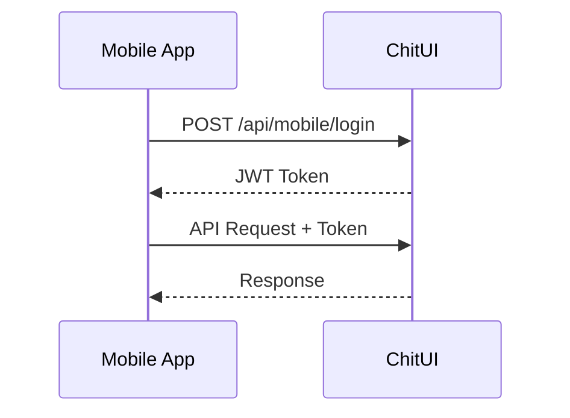

# ChitUI Mobile API Documentation

Complete API reference for mobile clients (Android, iOS, etc.)

## Base URL

```
http://YOUR_RASPBERRY_PI_IP:8080
```

## Authentication

ChitUI supports two authentication methods:

1. **Session-based** (for web browsers) - Uses cookies
2. **Token-based** (for mobile apps) - Uses JWT tokens

### Token Authentication Flow



---

## Endpoints

### 📱 Mobile Authentication

#### Login

**POST** `/api/mobile/login`

Get JWT token for authentication.

**Request:**
```json
{
  "password": "your_password"
}
```

**Response (Success):**
```json
{
  "success": true,
  "token": "eyJ0eXAiOiJKV1QiLCJhbGciOiJIUzI1NiJ9...",
  "expires_in": 2592000,
  "user_id": "admin",
  "require_password_change": false
}
```

**Response (Error):**
```json
{
  "success": false,
  "message": "Invalid password"
}
```

**Status Codes:**
- `200` - Login successful
- `401` - Invalid password
- `500` - Server error

---

#### Refresh Token

**POST** `/api/mobile/refresh-token`

Get a new token with extended expiry.

**Headers:**
```
Authorization: Bearer <your_current_token>
```

**Response:**
```json
{
  "success": true,
  "token": "new_token_here",
  "expires_in": 2592000
}
```

---

### 🖨️ Printer Management

#### Get All Printers

**GET** `/api/mobile/printers`

Get list of all discovered printers.

**Headers:**
```
Authorization: Bearer <token>
```

**Response:**
```json
{
  "success": true,
  "printers": [
    {
      "id": "AA:BB:CC:DD:EE:FF",
      "name": "My Printer",
      "ip": "192.168.1.50",
      "port": 3030,
      "status": "connected",
      "current_file": "model.ctb",
      "progress": 45,
      "MainboardID": "AA:BB:CC:DD:EE:FF",
      "Attributes": {
        "MachineName": "Chitu Printer",
        "MachineType": "MSLA",
        "CurrentStatus": "Printing",
        "CurrentFile": "model.ctb"
      }
    }
  ],
  "count": 1
}
```

---

#### Get Printer Info

**GET** `/api/mobile/printer/{printer_id}/info`

Get detailed information about a specific printer.

**Headers:**
```
Authorization: Bearer <token>
```

**Parameters:**
- `printer_id` (path) - Printer's MAC address

**Response:**
```json
{
  "success": true,
  "printer": {
    "id": "AA:BB:CC:DD:EE:FF",
    "name": "My Printer",
    "ip": "192.168.1.50",
    "Attributes": {
      "MachineName": "Chitu Printer",
      "MachineType": "MSLA",
      "Resolution": "2560x1620",
      "CurrentStatus": "Printing",
      "CurrentFile": "model.ctb",
      "PrintingLayer": 450,
      "TotalLayer": 1000,
      "PrintedTime": 3600,
      "RemainTime": 4200,
      "Temperature": 25,
      "FileList": [
        {
          "FileName": "model.ctb",
          "FileSize": 1024000,
          "CreatTime": "2024-01-15 10:30:00"
        }
      ]
    }
  }
}
```

**Error Response:**
```json
{
  "success": false,
  "message": "Printer not found"
}
```

**Status Codes:**
- `200` - Success
- `404` - Printer not found
- `401` - Unauthorized (invalid token)

---

### ⚙️ System Status

#### Get System Status

**GET** `/api/mobile/status`

Get ChitUI system information.

**Headers:**
```
Authorization: Bearer <token>
```

**Response:**
```json
{
  "success": true,
  "status": {
    "usb_gadget_enabled": true,
    "usb_gadget_available": true,
    "usb_auto_refresh": false,
    "upload_folder": "/home/pi/ChitUI_v1/data/uploads",
    "data_folder": "/home/pi/ChitUI_v1/data",
    "camera_support": false,
    "printer_count": 2,
    "active_connections": 2
  }
}
```

---

### 🔍 Additional Endpoints (Use existing routes)

These endpoints work with token authentication but use the existing ChitUI routes:

#### Discover Printers

**POST** `/discover`

**Headers:**
```
Authorization: Bearer <token>
```

Triggers network discovery for new printers.

---

#### Upload File

**POST** `/upload`

**Headers:**
```
Authorization: Bearer <token>
Content-Type: multipart/form-data
```

**Parameters:**
- `printer_id` (query) - Target printer ID
- `file` (form-data) - G-code file (.ctb, .goo, .prz)

Upload G-code file to printer.

---

## Socket.IO Real-time Events

Connect to the same URL via Socket.IO for real-time updates.

### Connection

```javascript
const socket = io("http://YOUR_PI_IP:8080", {
  auth: {
    token: "your_jwt_token"  // Optional
  }
});
```

### Events to Emit (Send)

#### Get Printer List
```javascript
socket.emit("get_printers");
```

#### Get Printer Attributes
```javascript
socket.emit("get_attributes", {
  printer_id: "AA:BB:CC:DD:EE:FF"
});
```

#### Print Actions
```javascript
// Start print
socket.emit("action_print", {
  printer_id: "AA:BB:CC:DD:EE:FF",
  file_name: "model.ctb"
});

// Pause print
socket.emit("action_pause", {
  printer_id: "AA:BB:CC:DD:EE:FF"
});

// Resume print
socket.emit("action_resume", {
  printer_id: "AA:BB:CC:DD:EE:FF"
});

// Stop print
socket.emit("action_stop", {
  printer_id: "AA:BB:CC:DD:EE:FF"
});
```

### Events to Listen (Receive)

#### Printer List Update
```javascript
socket.on("printers", (printerList) => {
  console.log("Printers:", printerList);
});
```

#### Printer Info Update
```javascript
socket.on("printer_info", (printerData) => {
  console.log("Printer info:", printerData);
});
```

#### Connection Events
```javascript
socket.on("connect", () => {
  console.log("Connected to ChitUI");
});

socket.on("disconnect", () => {
  console.log("Disconnected from ChitUI");
});

socket.on("connect_error", (error) => {
  console.error("Connection error:", error);
});
```

---

## Error Handling

### Common HTTP Status Codes

- `200` - Success
- `401` - Unauthorized (missing or invalid token)
- `403` - Forbidden (password change required)
- `404` - Not found (printer/resource doesn't exist)
- `500` - Server error

### Standard Error Response

```json
{
  "success": false,
  "message": "Error description here"
}
```

---

## Token Management

### Token Expiry

- Default: **720 hours (30 days)**
- Configurable via `TOKEN_EXPIRY_HOURS` environment variable
- Returned in `expires_in` field (seconds)

### Token Storage

Mobile apps should:
1. Store token securely (SharedPreferences/Keychain)
2. Include expiry timestamp
3. Check expiry before each request
4. Refresh token when close to expiry
5. Re-login if refresh fails

### Token Format

Tokens are JWT (JSON Web Tokens) with:

**Header:**
```json
{
  "typ": "JWT",
  "alg": "HS256"
}
```

**Payload:**
```json
{
  "user_id": "admin",
  "iat": 1234567890,
  "exp": 1237159890
}
```

---

## Rate Limiting

Currently no rate limiting is implemented, but best practices:

- Don't poll APIs faster than 1 request/second
- Use Socket.IO for real-time updates instead of polling
- Cache responses when appropriate

---

## Security Best Practices

### For Mobile Apps:

1. **Always use HTTPS** in production
2. **Store tokens securely** (encrypted storage)
3. **Never log tokens** in production
4. **Validate SSL certificates** (no self-signed certs)
5. **Clear tokens on logout**
6. **Implement token refresh** before expiry

### For Server:

1. **Change default password** immediately
2. **Use strong SECRET_KEY** for JWT signing
3. **Enable HTTPS** with valid certificate
4. **Consider VPN** (Tailscale) for remote access
5. **Keep ChitUI updated**

---

## Testing with curl

### Login
```bash
curl -X POST http://192.168.1.100:8080/api/mobile/login \
  -H "Content-Type: application/json" \
  -d '{"password": "admin"}'
```

### Get Printers (with token)
```bash
TOKEN="your_token_here"

curl http://192.168.1.100:8080/api/mobile/printers \
  -H "Authorization: Bearer $TOKEN"
```

### Get Status
```bash
curl http://192.168.1.100:8080/api/mobile/status \
  -H "Authorization: Bearer $TOKEN"
```

---

## Examples

### Full Authentication Flow

```bash
# 1. Login
RESPONSE=$(curl -s -X POST http://192.168.1.100:8080/api/mobile/login \
  -H "Content-Type: application/json" \
  -d '{"password": "admin"}')

# 2. Extract token
TOKEN=$(echo $RESPONSE | jq -r '.token')

# 3. Use token for authenticated request
curl http://192.168.1.100:8080/api/mobile/printers \
  -H "Authorization: Bearer $TOKEN"
```

---

## Changelog

### Version 1.0 (Current)

- ✅ Token-based authentication
- ✅ Mobile login endpoint
- ✅ Token refresh endpoint
- ✅ Printer list endpoint
- ✅ Printer info endpoint
- ✅ System status endpoint
- ✅ Socket.IO support with JWT

### Future Enhancements

- [ ] User management (multiple users)
- [ ] API versioning
- [ ] Rate limiting
- [ ] Webhook notifications
- [ ] GraphQL endpoint

---

For more information, see the [Android Quick Start Guide](ANDROID_QUICK_START.md).
